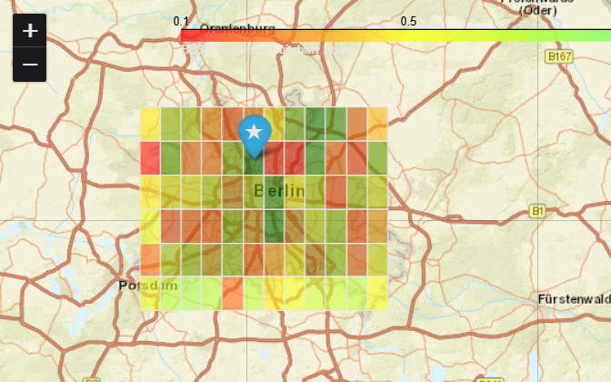

# 🗺️ Berlin BESS Spatial Analysis (Peak Shaving)

[](https://oxqnglmzpgvuvqz74hatic.streamlit.app/)
[](https://www.python.org/)
[](https://geopandas.org/)
[](https://opensource.org/licenses/MIT)

An interactive GIS and Multi-Criteria Decision Analysis (MCDA) tool designed to determine the absolute optimal geographical locations for placing Battery Energy Storage Systems (BESS) within the Berlin distribution grid (Stromnetz Berlin). 


> *Note: Interactive visualization of the 5MW BESS placement optimization.*

---

## 📌 Executive Summary
With the increasing integration of renewable energy and electric vehicles, urban grids face significant congestion. This project leverages spatial data engineering to identify optimal BESS installation zones for **Peak Shaving**. The model dynamically evaluates generated zones based on customized technical and economic parameters.

### ⚖️ MCDA Parameters & Weighting
The decision engine normalizes three core datasets and ranks them based on customizable weights. The default highly-optimized configuration is:

| Evaluation Criterion | Default Weight | Objective | Description |
| :--- | :---: | :---: | :--- |
| **Grid Congestion** | **50%** | Maximize | Areas with high peak-load risks needing immediate relief. |
| **Land Price** | **30%** | Minimize | Lower real estate costs (€/m²) to improve project ROI. |
| **Solar Potential** | **20%** | Maximize | High local PV generation capacity (MWh) for hybrid setups. |

---

## 🛠️ Technology Stack
| Category | Libraries / Tools |
| :--- | :--- |
| **Core Logic & Data** | `GeoPandas`, `Shapely`, `Pandas`, `NumPy` |
| **GIS Visualization** | `Folium`, `branca`, Esri ArcGIS Tiles |
| **Web Dashboard** | `Streamlit`, `streamlit-folium` |
| **Quality Assurance** | `Pytest` (Unit Testing) |

---

## 🏗️ Repository Structure
A modular, production-ready project architecture:

```text
📦 berlin-bess-spatial-analysis
 ┣ 📂 data                  # Generated GeoJSON spatial databases
 ┣ 📂 outputs               # Static assets and map snapshots
 ┣ 📂 src                   
 ┃ ┗ 📜 spatial_logic.py    # Core MCDA mathematics and normalization logic
 ┣ 📂 tests                 
 ┃ ┗ 📜 test_spatial.py     # Automated unit tests for logic validation
 ┣ 📜 app.py                # Main Streamlit dashboard application
 ┣ 📜 prepare_data.py       # Script for spatial grid and synthetic data generation
 ┣ 📜 requirements.txt      # Python dependencies
 ┗ 📜 README.md             # Project documentation
